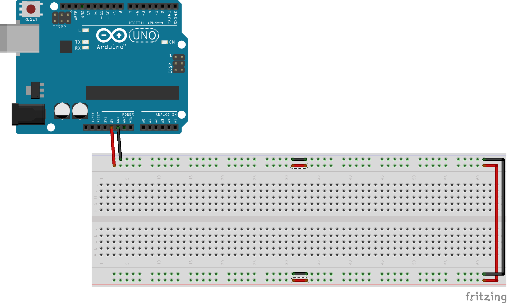
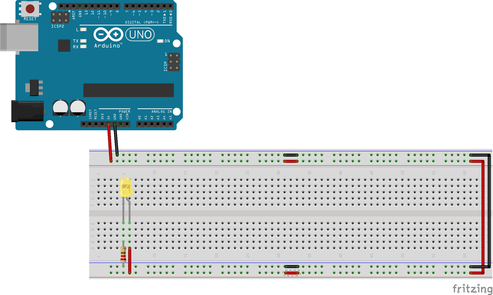
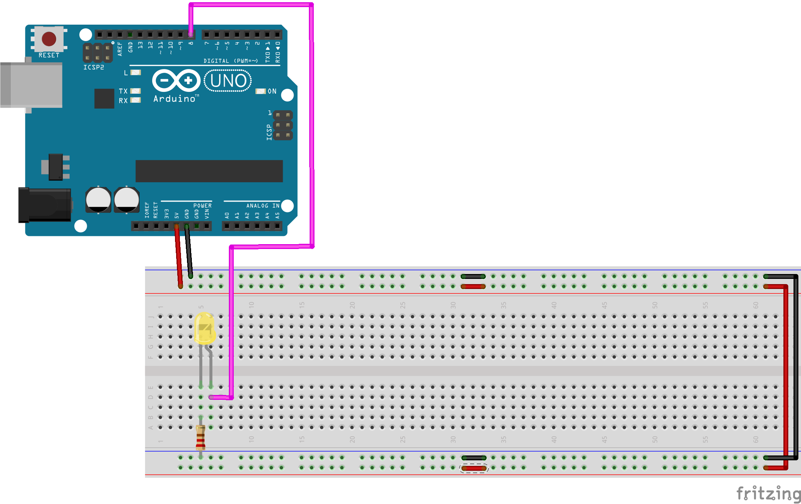
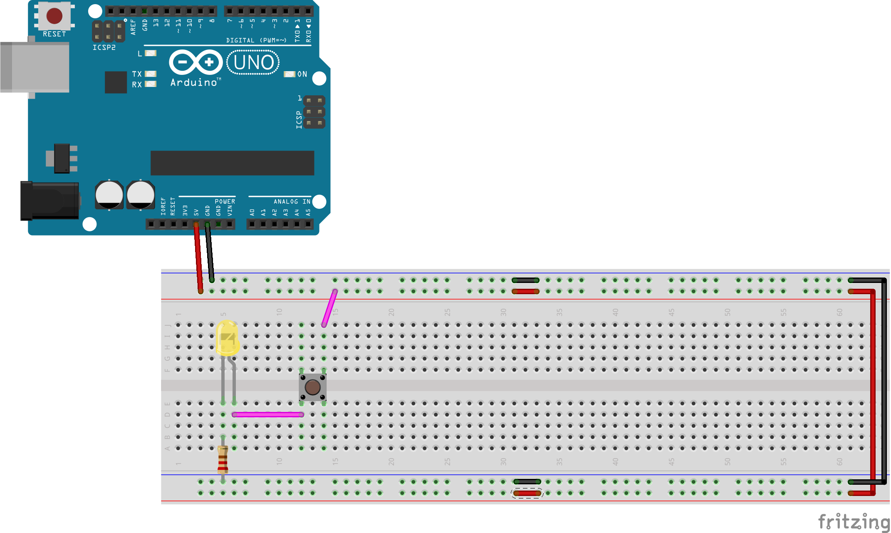
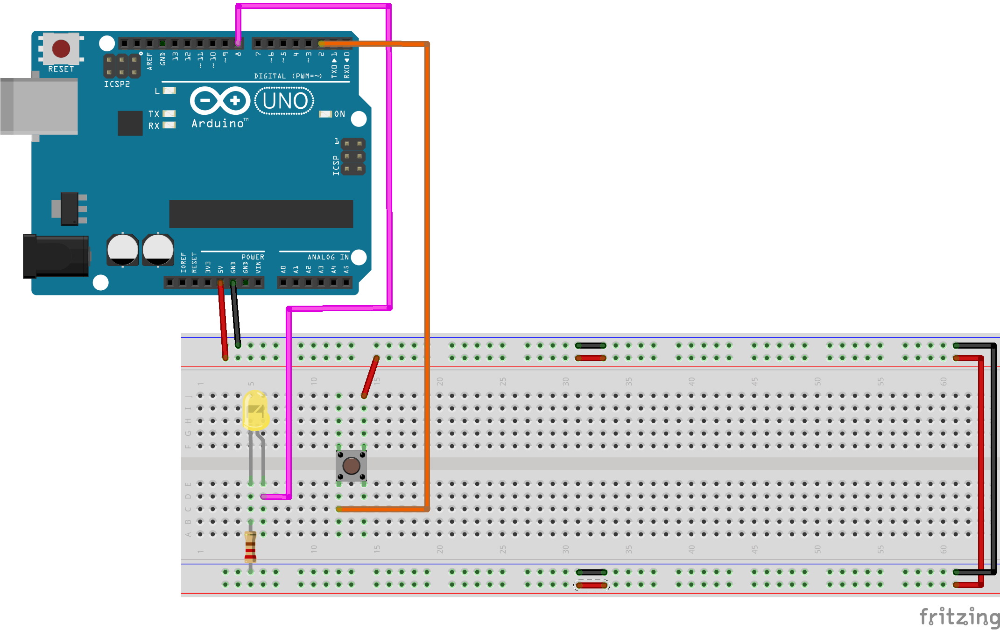
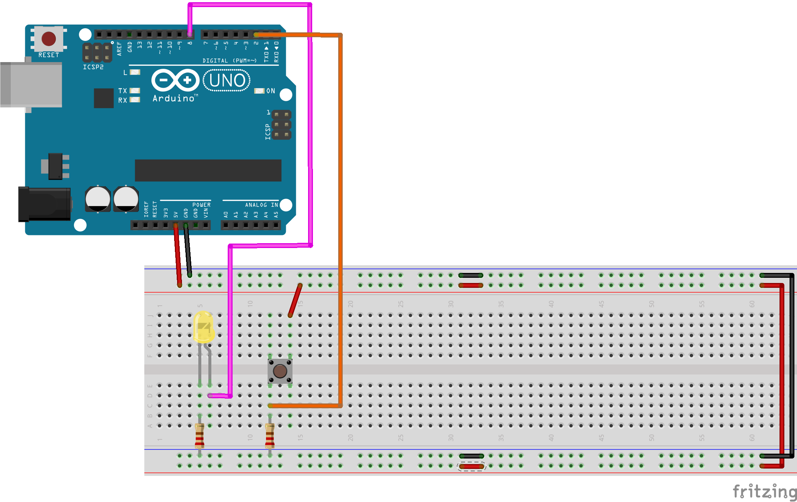

# Devetry Lunch and Learn
## Programable Hardware with Arduino

### Our base board configuration:
Please configure your board as follows using eight `jumper cables`:

In the above diagram, we connect the 5V pin on the Arduino to the HIGH rail on our breadboard, and the Ground pin oun our Arduino to the LOW rail.

We also connect our rails together.



### A simple circuit:
- **Note**:, how there is no software required for this circuit.
0. Ensure that your Arduino is connected to your Laptop with the Blue USB Cable.
1. Plug your `LED` as shown into the breadboard.
  - Take note of which side is the `anode` (long wire) and `cathode` (short wire).  (The side with the `cathode` also has a small divot next to it's extruding wire.)
2. Using a `jumper cable`, plug the `anode` of the LED into the HIGH RAIL
3. Using a 220 Ohm Resistor (`Red Red Brown` or `Red Red Black Black`), connect the `cathode` to the LOW RAIL.

- **NOTE**: Never complete an LED circuit **directly** between `5V` and `GND` without a resistor.  Your LED will blow, and you may burn your finger.



### Controlling our LED with Software:
0. Remove the `jumper cable` connecting your LED's `anode` to the HIGH RAIL and connect it to `pin 8` on the Arduino.



1. Open the Arduino Software
2. To to `tools > port` and ensure the selection contains `Arduino` somewhere
3. Copy/Paste the sketch below into the IDE.

```cpp
const int LED_PIN {8};
int LED_STATE {HIGH};

void setup()
{
  pinMode(LED_PIN, OUTPUT);
}

void loop()
{  
  digitalWrite(LED_PIN, LED_STATE);
  delay(500);
  LED_STATE = !LED_STATE;
}
```

4. Click the `upload` button. (Above the sketch tab, rightward facing arrow)

Note how the LED pulses every half second.

### Controlling the LED with a momentary switch (pushbutton):
1.  Unplug LED from the breadboard
2.  Add a momentary switch (pushbutton) according to the following diagram



Note how the button turns the LED on and off with a basic circuit

### Controlling the LED with a momentary switch in software:

1.  Remove the magenta jumper cables from the previous diagram
2.  Connect the `anode` of the LED to pin 8 on the Arduino
3.  Connect the pushbutton to pin 2 of the Arduino as shown in the diagram



```cpp
const int LED_PIN {8};
const int BUTTON_PIN {2};

void setup()
{
  pinMode(LED_PIN, OUTPUT);
  pinMode(BUTTON_PIN, INPUT);
}

void loop()
{  
  digitalWrite(LED_PIN, digitalRead(BUTTON_PIN));
}
```

Note the funky LED.  It is sometimes turning on all by itself...
To fix this we will need to add a `pulldown resistor` to our circuit.

Add one according to the following diagram:



- The `pulldown resistor` completes a circuit from `pin 8` to ground THROUGH A RESISTOR.
- So when the button is NOT pressed, we say that `pin 8` is `grounded` ensuring the resting logic level is `LOW`
- However, when we push the button, electricity can flow between `5V` and `pin 8` thus brining the logic level `HIGH`

### Toggling the LED with with software:

Without changing our circuit, we can update our source code to look like the following.

1.  Compile and upload this code to your Arduino
2.  Note any unusual behavior

```cpp
const int LED_PIN {8};
const int BUTTON_PIN {2};

int LED_STATE {LOW};

void setup()
{
  pinMode(LED_PIN, OUTPUT);
  pinMode(BUTTON_PIN, INPUT);
}

void loop()
{
  if (digitalRead(BUTTON_PIN))
    LED_STATE = !LED_STATE;
  digitalWrite(LED_PIN, LED_STATE);
}
```

### De-bouncing our momentary switch with software:

Our pushbutton is "bouncing"


Let's see how we can resolve this with software:


```cpp
const int LED_PIN {8};
const int BUTTON_PIN {2};

int LED_STATE {LOW};

void setup()
{
  pinMode(LED_PIN, OUTPUT);
  pinMode(BUTTON_PIN, INPUT);
}

void loop()
{
  if (digitalRead(BUTTON_PIN))
  {
    delay(40);
    if (digitalRead(BUTTON_PIN))
      LED_STATE = !LED_STATE;
  }
  digitalWrite(LED_PIN, LED_STATE);
}
```

We add a 40 millisecond delay after a the button is read in the HIGH state to allow the bouncing to settle.

### Making our LED blink via a button press:

The LED will start blinking, but will it stop?

```cpp
const int LED_PIN {8};
const int BUTTON_PIN {2};

int LED_STATE{LOW};
bool LED_BLINKING {false};

void setup()
{
  pinMode(LED_PIN, OUTPUT);
  pinMode(BUTTON_PIN, INPUT);
}

void loop()
{
  if (digitalRead(BUTTON_PIN))
  {
    delay(40);
    if (digitalRead(BUTTON_PIN))
      LED_BLINKING = !LED_BLINKING;
  }
  if (LED_BLINKING)
  {
    digitalWrite(LED_PIN, LED_STATE);
    delay(500);
    LED_STATE = !LED_STATE;
  }
}
```

- The `delay` command actually halts all activity on the Arduino temporarily.
- This means the main loop is **not** being executed, and consequently the `digitalRead` on our `BUTTON_PIN` is not executed.
- In order to toggle LED_BLINKING therefore, we would have to time our button press at the exact moment that we are not `delay`'ing execution.

### Fixing our blink behavior with a hardware interrupt:


```cpp
const int LED_PIN {8};
const int BUTTON_PIN {2};

int LED_STATE{LOW};
bool LED_BLINKING {false};

void setup()
{
  pinMode(LED_PIN, OUTPUT);
  pinMode(BUTTON_PIN, INPUT);
  attachInterrupt(digitalPinToInterrupt(BUTTON_PIN), readButtonPinWithDebounce, RISING);
}

void readButtonPinWithDebounce()
{
  delay(40);
  if (digitalRead(BUTTON_PIN))
    LED_BLINKING = !LED_BLINKING;
}

void loop()
{
  if (LED_BLINKING)
  {
    digitalWrite(LED_PIN, LED_STATE);
    delay(500);
    LED_STATE = !LED_STATE;
  }
  else
  {
    digitalWrite(LED_PIN, LOW);
  }
}
```

- We configure our button pin to be an `interruptPin` that will call the function `readButtonPinWithDebounce` when it receives a `HIGH` signal.